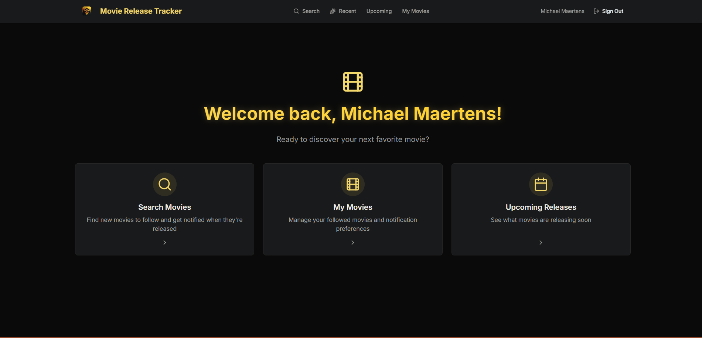

 # Hey there 👋

  I'm Mike — a hobbyist developer who codes for fun and loves learning new things.
  Right now, I'm building **MovieReleaseTracker** 🎬 — an app to follow upcoming movies and get notified when they hit theaters or streaming.

  ---

  ## 🎥 MovieReleaseTracker V3
  

    
  

  **[🚀 Live Demo](https://moviereleasetracker.vercel.app/)**

  - **Stack:** Next.js 16, TypeScript, Supabase, Tailwind CSS v4, TMDB API, Brevo, Upstash Redis
  - **Features:**
    - Search and discover movies with real-time TMDB data
    - Follow movies for theatrical, streaming, or both release types
    - Recent releases page with infinite scroll
    - Automated daily notifications when movies are released
    - Background jobs for cache refresh and release date discovery
    - Modern authentication with password reset via email
  - **UI Highlights:**
    - Dark theme with golden accents (#F3D96B)
    - Floating label inputs (Stripe/Figma style)
    - Multiple movie card design variants
    - Fully responsive mobile-first design

  ---

  ## 🛠️ Tech Stack
  
  
  
  
  
  
  
  

  ---

  💡 Not a professional developer — just building stuff I think is cool.
